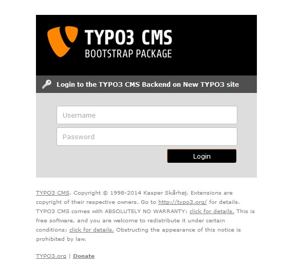

.. ==================================================
.. FOR YOUR INFORMATION
.. --------------------------------------------------
.. -*- coding: utf-8 -*- with BOM.

.. include:: ../Includes.txt

Introduction
============

What does it do?
----------------

The extension enables you to set up an own backend login skin.
You can define a template and css file for the whole TYPO3 system or each per domain.

A simple template and a stylesheet are shipped with the extension which you can use to customize your backend login.

Screenshots
-----------

	Backend login form after extension installation